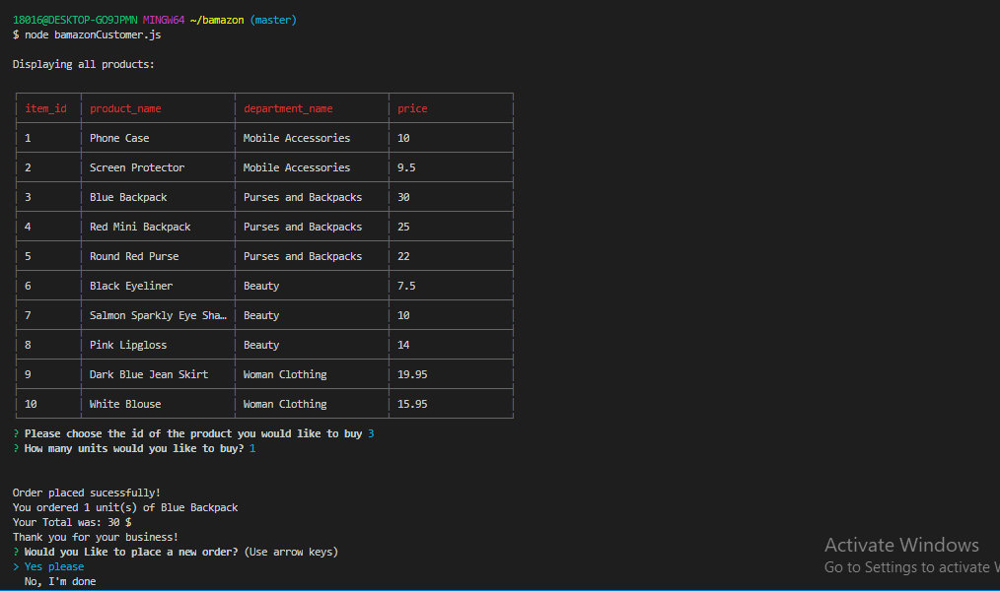
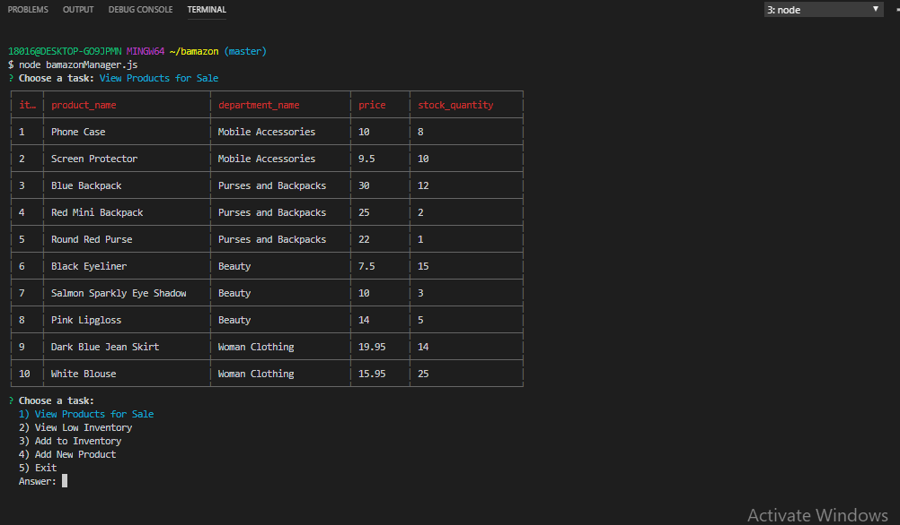
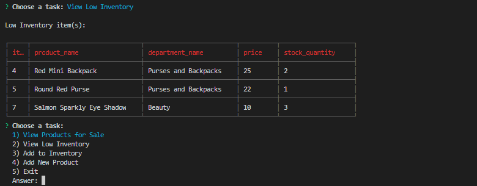
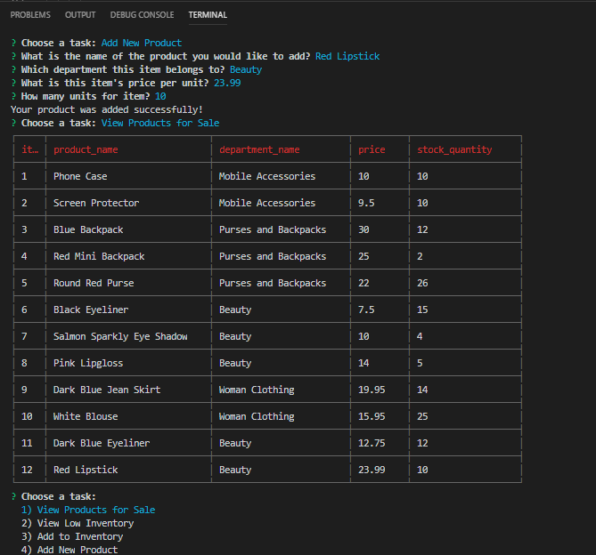
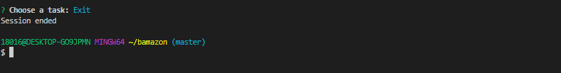
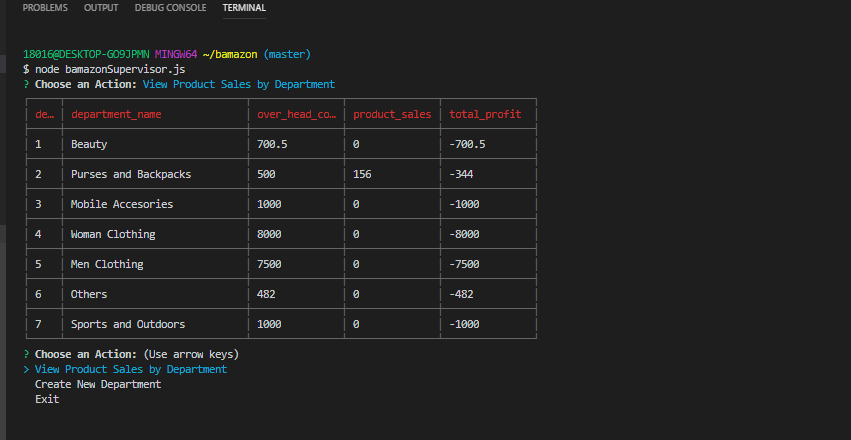
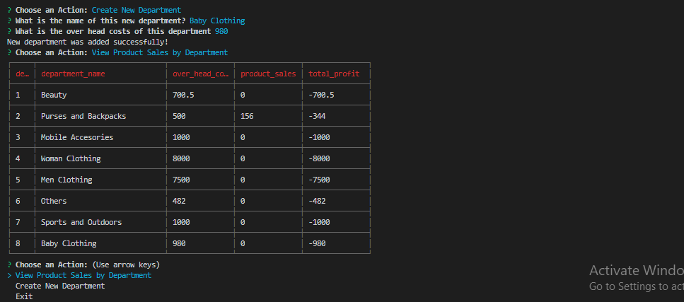

# bamazon
This is a Command Line Interface (CLI) app. There is 3 different versions of this app built in this code. The first version is an online-store simulator, the second version is a manager app for the store simultor, and the third version is a department supervisor app for the store simulator.

This project has the inquirer node manager package, and the mysql manager package installed. The mysql package is used to connect with mysql workbench and redeem the tables: "products" and "departments" from database called bamazon.

To run this code: create your own database with the name bamazon and create 2 tables: 
1)products 
inside this table enter the following columns:

item_id (type: INT NOT NULL AUTO_INCREMENT),
product_name (type: VARCHAR(100) NULL),
department_name (type: VARCHAR(100) NULL),
price (type: DECIMAL(10,2) NULL),
stock_quantity (type: integer(100) NULL),
product_sales (type:DECIMAL(65,2) NULL),

2)departments
inside this table enter the following columns:

department_id (type: INT NOT NULL AUTO_INCREMENT),
department_name (type: VARCHAR(100) NULL),
over_head_costs (type:DECIMAL(65,2) NULL),
 
 Also, add your information to connect to your mysql database. Enter your port, username and password.

 Finally, you can run the applications with these 3 options: 

online-store simulator: node bamazonCustomer.js
supervisor view of store-simulator: node bamazonSupervisor.js
Manager view if store-simulator: node bamazonManager.js

*Example on how to run this code in the Command Line:*
*$ node bamazonManager.js*
*? Choose a task:*
  *1) View Products for Sale*
  *2) View Low Inventory*
  *3) Add to Inventory*
  *4) Add New Product*
  *5) Exit*
  *Answer:*

Developer: Ginna Campbell
Technologies applied: Node.js

